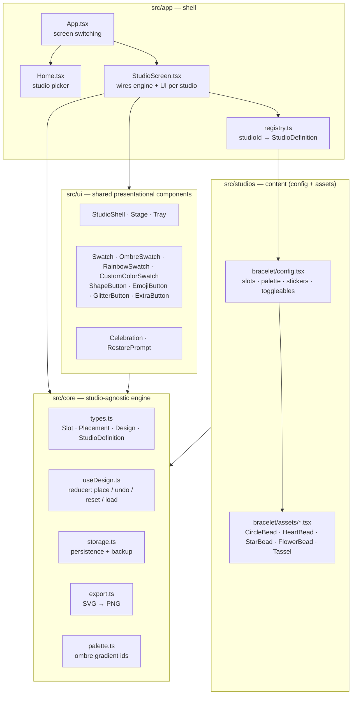
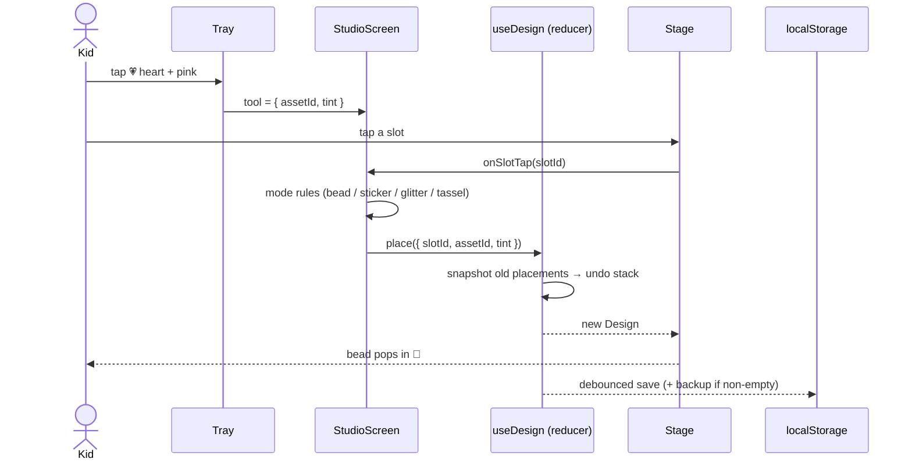
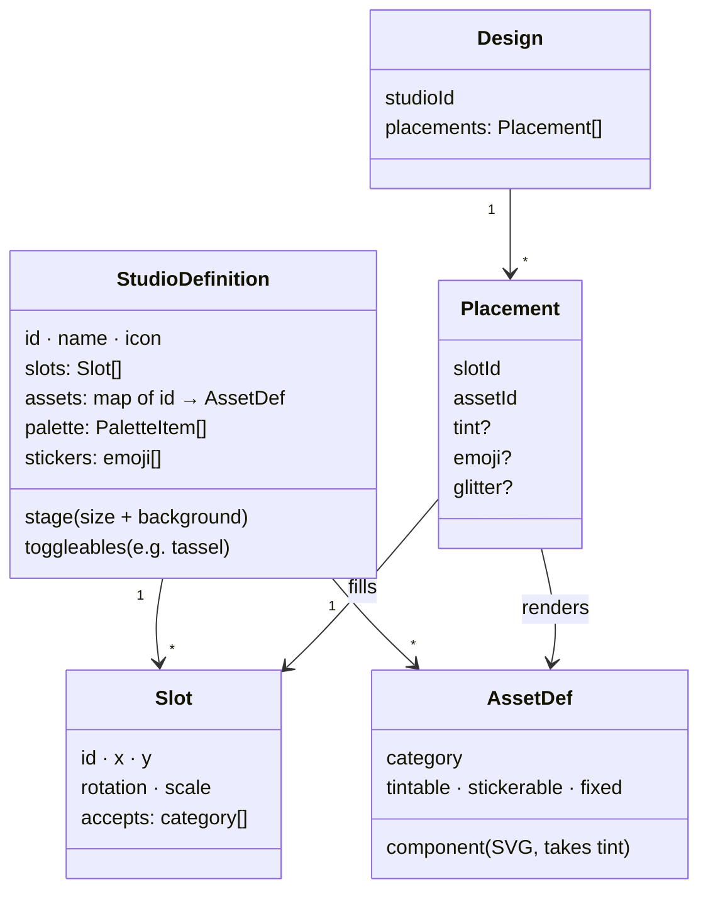

# ✨ Sparkle Studio

A free, no-ads collection of creative mini-studios for kids (ages 4–10). No brushes, no drawing — every interaction feels like placing stickers: **tap a color, tap a spot, done.**

## Studios

- **📿 Bracelet Maker** — build a bracelet bead by bead
- **🧁 Cupcake Designer** — coming soon
- **🍦 Ice Cream Creator** — coming soon

## Features

### Creating
- **4 bead shapes** (circle, heart, star, flower) placed on 14 slots around the bracelet
- **Tap-to-fill**: pick a shape and color, tap a slot — the bead pops in with a springy animation; tap a filled bead to recolor or reshape it
- **Rich color tray**: 12 preset colors, a rainbow swatch that cycles colors on each tap, 3 ombre gradients, and a native color picker for any custom color
- **Emoji stickers** (⭐ 🌸 🦋 🌈 💎 🍭 🎀) that sit on top of circle beads — valid targets glow, everything else dims, no explanation needed
- **Glitter mode**: toggle ✨ and tap beads to add a twinkling shimmer over any color, ombre, or custom color
- **Tassel**: one tap adds a tassel hanging from the bottom of the bracelet in the current color; tap the button again to remove it

### Kid-proofing
- **Undo instead of confirmation dialogs** — even "Start over" is undoable
- **Backup restore**: if a design gets wiped (Start over + reload), a gentle prompt offers to bring back the last bracelet
- No text instructions anywhere; the UI communicates through glow, dim, and motion
- No double-tap zoom, no text selection, no accidental scrolling

### Keeping creations
- **Save to PNG** — a full-screen confetti celebration ("So pretty! ✨"), then the bracelet downloads as an image
- **Auto-persistence** — the current design saves to localStorage on every change and restores on reopen
- **Works offline** — installable PWA; after the first visit it runs with no connection at all (plane-friendly)

### Everywhere
- Fully responsive: phones get a compact two-row color grid, tablets and desktops a scrolling tray
- Touch targets sized for small hands (44–64px)

## Architecture

The whole app is one idea: **a studio is a scene made of slots, and a design is a list of what's in each slot.** The engine knows nothing about bracelets — it fills slots, undoes, saves, and exports. Each studio is just configuration plus small SVG asset components.

### Layers

Dependencies point downward only — `core` and `ui` never import from `studios`:



### One tap, end to end



### The data model

A creation is tiny and fully serializable — this is what makes undo, persistence, backup restore, and PNG export nearly free:



### Assets are components, not files

Every visual piece (bead, tassel — later frosting, scoops, …) is a small React component drawing SVG, centered on `(0,0)` in a ~100-unit box, taking a `tint` prop for its colorable regions:

```tsx
export const HeartBead: BeadAsset = ({ tint }) => (
  <g>
    <path d="M 0 42 C ..." fill={tint} stroke="rgba(0,0,0,0.18)" />
    <ellipse /* fixed white highlight */ />
  </g>
);
```

No SVG build pipeline, no design-tool dependency; tinting (including ombre gradients via `url(#...)` paint refs) is just a prop.

### Adding a new studio

The test every refactor is held to: **a new studio requires zero engine changes.**

1. Create `src/studios/<name>/config.tsx` — a `StudioDefinition` (slots, palette, assets, stickers)
2. Author the asset components in `src/studios/<name>/assets/`
3. Register it in `src/app/registry.ts` (one line)

The home screen card, tray, undo, save, persistence, backup restore, PWA caching, and PNG export all come along for free.

## Tech

React 19 · TypeScript · Vite · SVG · [vite-plugin-pwa](https://vite-pwa-org.netlify.app/) (offline support)

No state library, no router, no CSS framework — one `useReducer` hook and plain CSS cover the current needs.

## Development

```sh
npm install
npm run dev      # local dev server
npm run build    # typecheck + production build (includes service worker)
npm run preview  # serve the production build (needed to test PWA/offline)
```

Deploys to production automatically from `main` via Vercel.

## License

[MIT](LICENSE)
